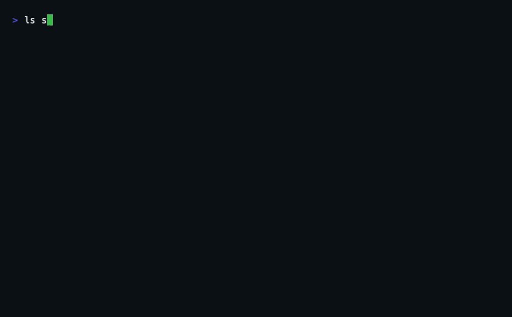

[English](./README.md) | **简体中文**

<div align="center">

# Counterstep

**为有写权限的编码代理准备的、经过排演验证的撤销账本。**


<br>

<a href="https://github.com/SuperMarioYL/counterstep/actions/workflows/ci.yml"></a>
<a href="https://www.npmjs.com/package/counterstep"></a>

<a href="./LICENSE"></a>


<br>
<br>

*“我的编码代理往 main 推了一个删掉所有文件的提交”——这件事不该是不可挽回的终点。
Counterstep 会在每一个破坏性操作**执行之前**，把一个经过排演验证的撤销操作准备好，
并在操作结果不对时，给你一个一键执行的账本。*

**免费开源，没有付费版，也没有任何功能被锁在付费墙后面。**

</div>

## 工作原理

Counterstep 挂在编码代理的工具调用链路上。当代理尝试破坏性操作——删除文件、
覆盖已有文件、强推分支——这次调用会被扣住，直到它对应的撤销操作存在并且被验证过：

<table>
<tr>
<td width="33%" valign="top">

<br>

<p>&nbsp; <b>指纹</b></p>

在任何东西被执行之前，先对受影响的状态做哈希：文件系统作用域的递归内容，
或者直接从远端读取的远程引用当前指向。

</td>
<td width="33%" valign="top">

<br>

<p>&nbsp; <b>排演</b></p>

构造出的逆操作会先作用到一份影子副本上，并且必须把指纹还原到操作前的值。
排演不通过，调用就不会放行。

</td>
<td width="33%" valign="top">

<br>

<p>&nbsp; <b>武装，然后执行</b></p>

逆操作在账本中武装完毕后，原调用才被允许执行。如果结果不对，
<code>counterstep fire --last</code> 会执行撤销并重新验证指纹。

</td>
</tr>
</table>

```
Claude Code ──PreToolUse (stdin JSON)──▶ counterstep hook
                                          ├─ classify: 是否属于破坏性操作？
                                          ├─ 构造逆操作（文件系统 | git 适配）
                                          ├─ 指纹 + 影子排演（.counterstep/shadow/）
                                          └─ 武装完成前拒绝；写入 .counterstep/ledger.jsonl
开发者 ──▶ counterstep ledger / counterstep fire <id>   （验证指纹，执行逆操作）
```

一个 npm 安装的 CLI。每次 hook 调用一个进程。状态就是一个目录——
没有守护进程，没有数据库。

## 快速开始

```bash
npm install -g counterstep

cd path/to/your/repo
counterstep init
```

`init` 做两件事：把 `PreToolUse` hook 写入 `.claude/settings.json`
（与现有配置合并，可重复执行），并创建 `.counterstep/` 状态目录——
账本加上存放排演载荷的影子仓库。请把 `.counterstep/` 加进你的 `.gitignore`。

之后照常使用你的代理。当它第一次尝试破坏性操作——`rm -rf src/legacy`、
覆盖一个已有文件、`git push --force origin main`——hook 会对状态做指纹，
构造逆操作，在影子副本上排演，全部通过后才放行这次调用。通常只需几秒。

如果结果不对：

```bash
counterstep ledger        # 查看已武装的逆操作及其指纹
counterstep fire --last   # 执行最近一次撤销，并重新验证
```

执行撤销时会重新对受影响的作用域做指纹：只有状态精确回到武装前的值才标记为
`fired`；如果期间有内容漂移则标记为 `stale`——漂移的文件不会被静默覆盖，
恢复是合并式的，留给你先检查。

### 不启动代理也能试

`examples/agent-call.sh` 会把 Claude Code 发送的原始载荷喂给 hook，
让你在普通终端里直接看到拦截过程：

```bash
./examples/agent-call.sh Bash "rm -rf src/legacy"   # hook 看到的载荷
counterstep ledger
rm -rf src/legacy
counterstep fire --last
```

## 演示



上面这段是真实录制的：`src/legacy` 按字节一致地恢复，被强推的远程引用
回退到武装时记录的提交——这是本地快照和 reflog 都够不着的外部副作用。
使用 [vhs](https://github.com/charmbracelet/vhs) 录制，可复现的脚本在
[docs/demo.tape](docs/demo.tape)。

## 为什么需要它

**审批不等于恢复。** 各类 harness 管住的是*决策*——审批对话框、沙箱。
可一旦被批准的破坏性调用执行了，"预防"就再没有什么可提供的了：审批对话框里
没有位置放"这是已武装的逆操作和它的验证指纹"。Counterstep 补上的是这次
握手的后一半——结果本身。

**快照是被动的，而且只覆盖本地。** 时间机器和 reflog 只有在"恰好先做了备份"
的情况下才帮得上忙，而且它们都够不着已经推出去的提交。Counterstep 把捕获
变成强制的——绑定到具体的破坏性调用、经过指纹校验——它的 git 逆操作能
恢复任何本地快照都触不到的远程引用。

**验证机制是机器可查的，不是一厢情愿。** Saga 补偿是几十年前的老概念；
这里的贡献是把它强塞进代理的工具调用，并配上一个排演裁判：逆操作必须能在
影子副本上证明自己能把指纹还原到操作前的值，原调用才会放行；执行撤销时
还会对照实时状态再验证一次。

**边界是明说的，不是藏着的。** 没有可构造逆操作的操作——第三方 HTTP 写入、
`git reset --hard`、通配符删除——都会被拒绝，并在拒绝理由里说明原因。
[docs/invertibility.md](docs/invertibility.md) 完整分类了破坏性调用面：
可逆的和被拒绝的都在上面。

## 账本状态

| 状态 | 含义 |
|---|---|
| `armed` | 逆操作已构造，排演通过，原调用已放行 |
| `fired` | 撤销已执行；执行后指纹与武装值一致 |
| `stale` | 撤销已执行；武装之后实时状态发生了漂移——重新武装前先检查 |
| `failed` | 逆操作无法执行（例如租约之下落入了第三方的提交）；远端保持原样未被触碰 |

## 路线图

- [v0.2 · 拦截并求逆](docs/invertibility.md#class-c--destructive-but-not-intercepted-in-v01) — `git clean`、`git checkout --`/`git restore` 以及 shell 重定向，一次补一个裁判
- [v0.2 · 工件格式规范](docs/invertibility.md#the-inverse-oracles) — 把补偿工件模式和 deny-until-armed 握手发布给 harness 与 MCP 工具作者
- [v0.3 · 更多 harness](https://github.com/SuperMarioYL/counterstep/issues) — 适配层每个 harness 一个文件；Cursor、Codex CLI 与 Windsurf 的 hook 都是同一个形状

v0.1 刻意只覆盖文件系统和 git 远程引用——为什么这样划界、账本还拒绝了哪些
操作并给出了什么理由，[docs/invertibility.md](docs/invertibility.md)
有常设的记录。

## 许可证

[MIT](./LICENSE) — 自由使用、修改和分发。

<p align="center"><sub><a href="./LICENSE">MIT</a> © 2026 SuperMarioYL</sub></p>
